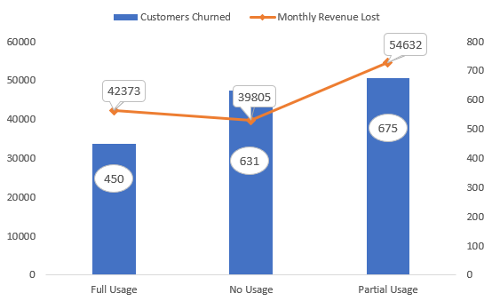
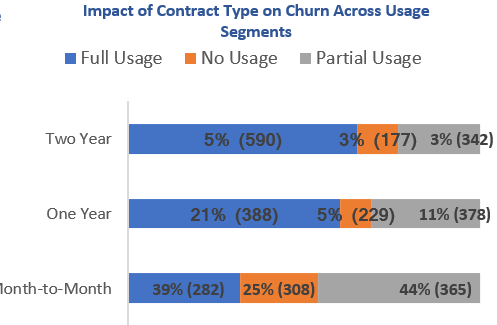
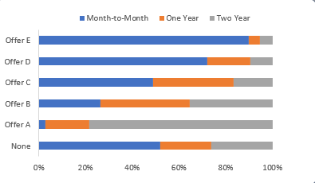
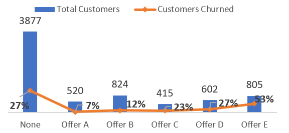
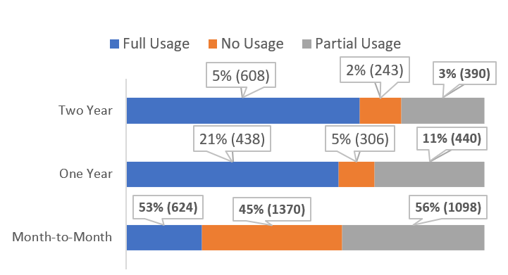
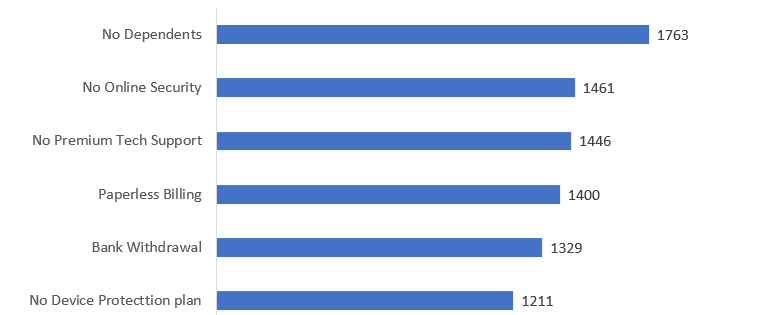
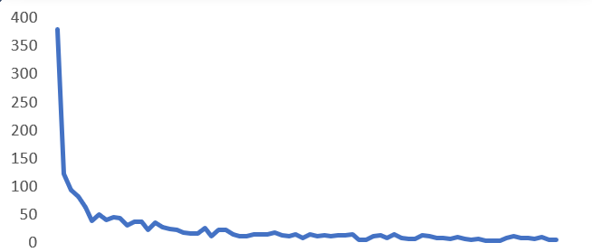

# 📊 Customer Churn Analysis (Excel Project)

## 📌 Overview
This project analyzes customer churn using Excel to identify key drivers of customer loss, revenue impact, and actionable strategies to improve retention.

## 🎯 Objectives
- Understand customer churn behavior and patterns  
- Identify high-risk customer segments  
- Analyze the impact of contracts, services, and payment methods  
- Discover key factors driving revenue loss  

## 🛠️ Tools Used
- Microsoft Excel (Data Cleaning, Analysis, Dashboard)

## 🔍 Key Insights
- Month-to-month customers have the highest churn  
- Fiber optic users are the most vulnerable segment  
- First 6 months are the highest-risk period  
- Longer tenure leads to lower churn  
- Low or no usage increases churn risk  
- Usage alone does not guarantee retention  
- Customers without dependents and bank withdrawal users show higher churn

 ## 📊 Data Visualizations & Key Insights

## 🔍 Key Insights

### 📌 Month-to-Month Contracts Drive Highest Churn

- Customers with **month-to-month contracts exhibit the highest churn rates**.
- The lack of long-term commitment and higher flexibility increases the likelihood of customers **switching or discontinuing services**.
- This highlights that **flexible contract models carry higher retention risk**.

---

### 📌 Fiber Optic Customers Are Most Vulnerable Segment

- **Fiber optic customers show the highest churn rates**, with a large proportion on **month-to-month contracts**.
- This combination makes them the **most vulnerable segment** due to low commitment.
- It indicates that **high-value services without long-term contracts are at greater churn risk**.

---

### 📌 Tenure Growth Improves Retention

  
  

- As **customer tenure increases**, there is a shift from **month-to-month to long-term contracts**, leading to lower churn rates.
- Offer distribution shows a progression from **Offer E → D → C → B → A** with increasing tenure.
- This suggests that offers may be **encouraging long-term commitment**, although the **no-offer segment still contributes significantly to churn**.

---

### 📌 Usage Alone Does Not Guarantee Retention

  
  

- Customers with **no usage have the highest churn**, driven by low engagement.
- However, even **high-usage customers churn under month-to-month contracts**.
- This indicates that **usage alone is not enough** — factors like **pricing and perceived value** play a crucial role.

---

### 📌 Low Engagement & Easy Exit Increase Churn

- Lower engagement with **support and additional services is strongly linked to higher churn**.
- Customers with **no dependents** and those using **bank withdrawal payment methods** show higher churn.
- This suggests that **lower emotional/financial commitment increases switching behavior**.

---

### 📌 Early Tenure Is the Highest Risk Period

- Churn is **highest within the first 6 months** of customer lifecycle.
- It decreases steadily as tenure increases.
- This highlights a **critical early-stage retention window** where intervention is most needed.

## 📄 Detailed Report

[View Full Report](Telecom%20Customer%20Churn%20Analysis.pdf)

## 💡 Recommendations
- Promote long-term contracts with discounts, bundled offers, and mid-term plans to reduce churn among month-to-month users.  
- Improve fiber optic customer retention by enhancing service quality and introducing loyalty programs.  
- Increase perceived value through value-added bundles such as premium support or additional services.  
- Encourage stable payment methods like auto-pay and credit cards to reduce payment-related churn.  
- Improve customer engagement through targeted campaigns highlighting unused services and benefits.  
- Focus on early-stage retention (first 6 months) with better onboarding, proactive support, and A/B testing of offers.  

## 🚀 Conclusion
This analysis shows that customer churn is mainly driven by contract flexibility, low engagement, and early-stage customer experience. By promoting long-term commitment, improving engagement, and focusing on early retention strategies, businesses can significantly reduce churn and improve overall customer lifetime value.focusing on long-term commitment, improving engagement, and strengthening early retention strategies, businesses can significantly reduce churn and enhance overall customer lifetime value.
